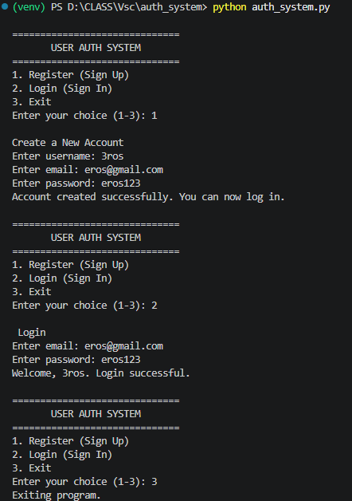
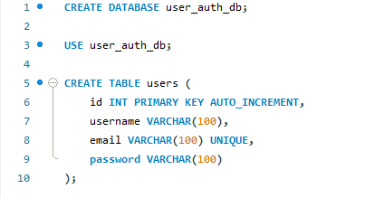
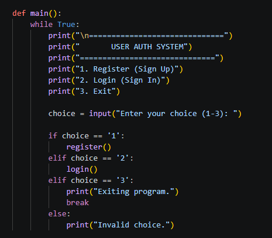
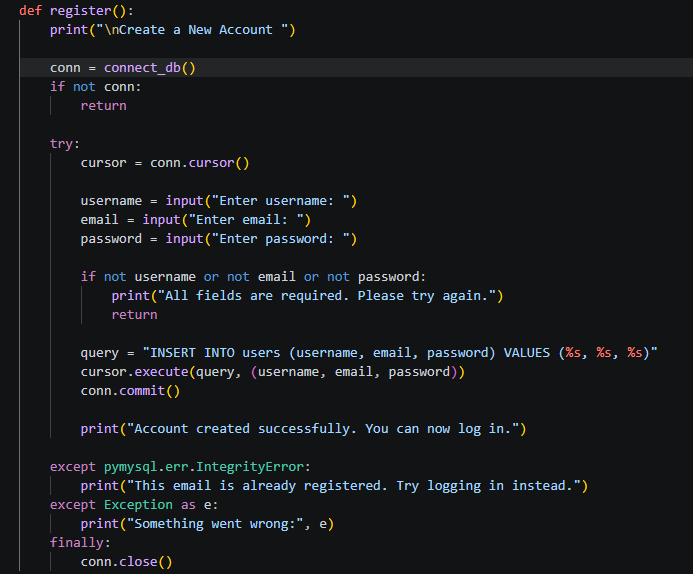
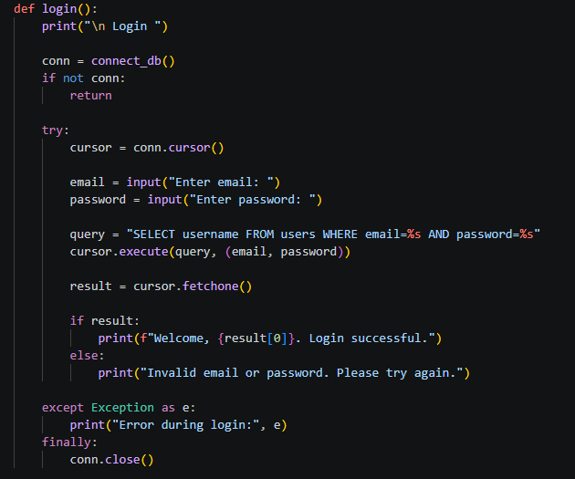

# Python + MySQL Authentication System

This is a simple menu-driven authentication system built using Python and MySQL.

## Features
- User Registration (Sign Up)
- User Login (Sign In)
- Duplicate Email Handling
- Database Integration using PyMySQL

## Tech Stack
- Python
- MySQL
- PyMySQL

## Database Setup

```sql
CREATE DATABASE user_auth_db;

USE user_auth_db;

CREATE TABLE users (
    id INT PRIMARY KEY AUTO_INCREMENT,
    username VARCHAR(100),
    email VARCHAR(100) UNIQUE,
    password VARCHAR(100)
);
```

## Project Preview

### 🚀 Application in Action


### 🗄️ Backend Database
| Database Schema | Registered Users |
| :---: | :---: |
|  |  |

### 📜 Code Implementation
| Main Menu | Registration Logic | Login Logic |
| :---: | :---: | :---: |
|  |  |  |
